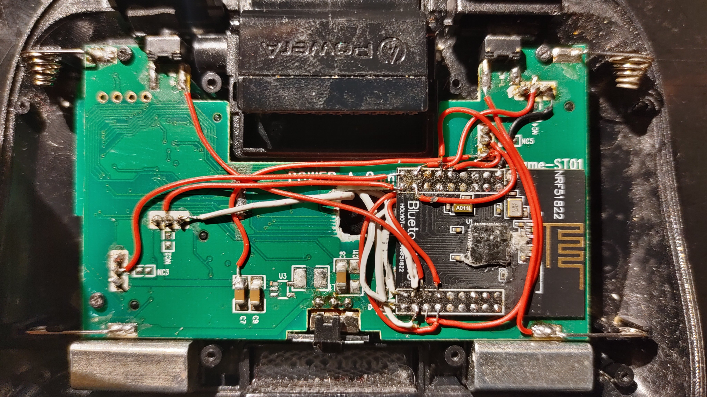

# ble_gamepa_mod

Add BLE support to any gamepad. Works on Windows, Android and Linux.

## Disclaimer

Make sure you know what you are doing as I wont have much time to explain/document the project any further.

## Requires 

- Hardware
  - A nrf51822 with only 16 kB  
  - some soldering and surgery
- Software
  - [nRF5 SDK 10.0.0](https://nsscprodmedia.blob.core.windows.net/prod/software-and-other-downloads/softdevices/s110/s110nrf51800.zip)
  - compiler: gcc-arm-none-eabi-4_9-2015q1

## How to compile

- make sure you can compile the SD samples
- modify the make file soit points to the SDK and toolchain
   - or copy my files onto `nordic_sdk/examples/ble_peripheral/ble_app_hids_keyboard`
- compile that sample, upload, enjoy

## Wiring diagram

Picture showing the wiring to a Moga gamepad (Moga only worked on Android and required installing some spyware)

# Extending
- find new keys codes and how to build the report map [here](https://www.usb.org/sites/default/files/documents/hut1_12v2.pdf)

